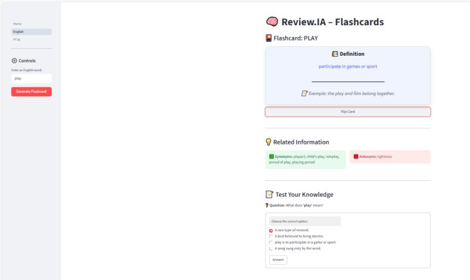

# 🧠 Review.IA – Flashcards Quizlet Style

---

**Review.IA** is an AI-powered English learning application developed in Python, focused on vocabulary acquisition through **interactive flashcards and knowledge testing**.

This project was created as an **academic MVP** and was **presented at regional scientific symposiums and academic events**, demonstrating the practical application of Artificial Intelligence in education.

---

## 🎯 Project Purpose

The main goal of Review.IA is to support English learners by combining:
- AI-generated learning content  
- Active recall through quizzes  
- A simple and intuitive study flow  

The project bridges **AI, education, and software engineering** into a functional learning tool.

---

## 🧠 How It Works

1. The user enters an English word  
2. The system generates:
   - Definition
   - Usage example
   - Synonyms and antonyms  
3. The learner reviews the content using flashcards  
4. A short quiz is generated to test understanding  

This flow reinforces learning through **exposure + validation**.

---

## ✨ Key Features

- AI-assisted flashcard generation  
- Vocabulary definitions with examples  
- Synonyms and antonyms support  
- Knowledge testing through multiple-choice questions  
- Clean and user-friendly interface  
- Educational focus with real academic application  

---

## 🖥️ Interface Preview

> The interface was designed to be simple, clean, and focused on learning efficiency.

---

## ⚙️ Tech Stack

- **Python**
- AI/NLP logic
- Flashcard-based learning system
- Quiz generation logic
- Web-based user interface

---

## 🎓 Academic Context

This project was developed during an academic course and later **presented at scientific symposiums and regional academic events**, highlighting:
- Practical use of AI in education  
- Software engineering applied to learning systems  
- MVP development with real-world evaluation  

---

## 🚧 Project Status

✔ Functional MVP  
🔧 Improvements and refinements ongoing  

Future enhancements may include:
- User progress tracking  
- Expanded AI personalization  
- Database integration  
- Deployment-ready architecture  

---

## 💡 Why This Project Matters

Review.IA is not just a study project — it is a **functional educational MVP** that demonstrates:
- Applied Artificial Intelligence  
- Product-oriented thinking  
- Academic and technical relevance  

---

## 👥 Authors & Credits

This project was developed collaboratively as part of an academic initiative.

**Core Contributors:**
- Natan Oliveira  
- Carlos Daniel  
- Heitor Pereira  
- Lucas Lima  

The team worked together on ideation, development, and presentation of the project at academic and scientific events.

